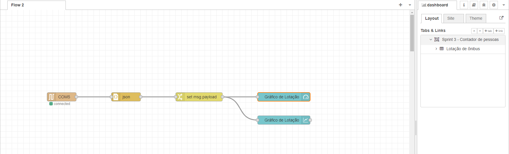
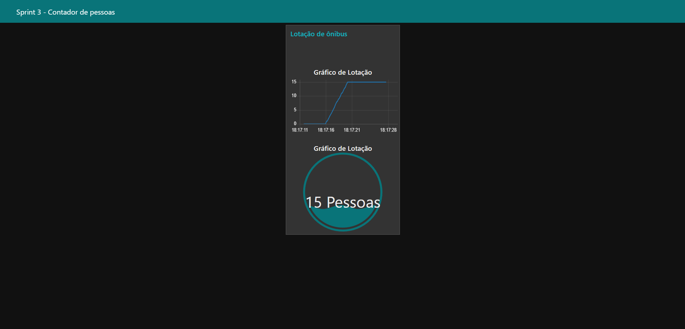
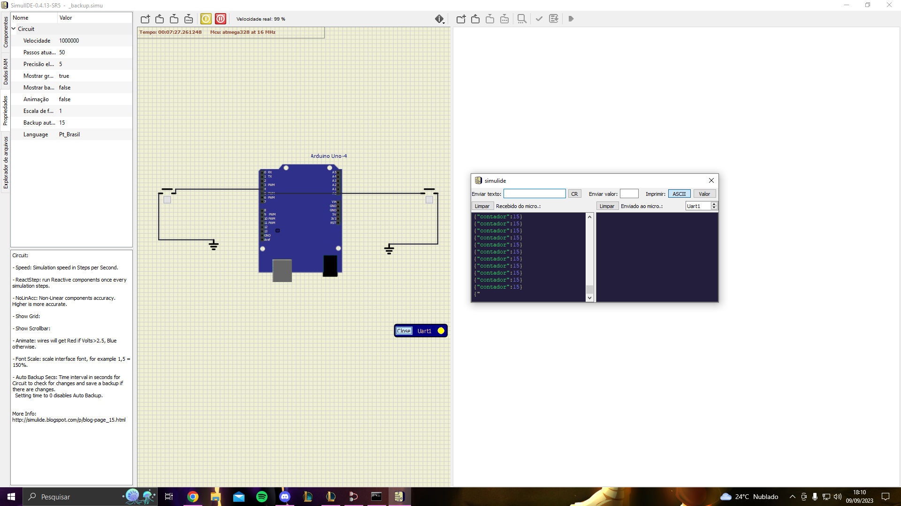
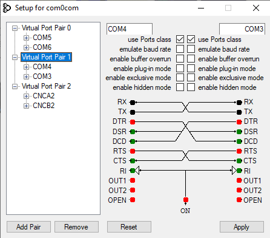

<h1 align="center">UrbanFlow - Sprint 3 Edge</h1>
 
 
 
 
  
## :link: Links
   
* Youtbe: https://youtu.be/vmT0nWzwzgU

## :memo: Descrição do projeto

* O urban flow é um aplicativo  que mostra para os usuarios, qual a melhor rota de ônibus que  o usuario deve tomar  para que chegue em seu destino com melhor tempo, tambem levando em consideração a lotação do ônibus para que o usuario não tenha que pegar um ônibus lotado, todas essas informações (lotação, localização e tempo de espera) são mostradas no aplicativo assim que você seleciona sua rota, onde você tambem pode salvar essa rota para caso utilize ela mais de uma vez e não queira pesquisar toda hora, e uma ultima funcionalidade é que a cada mês o sistema gera um relatorio com todas as informações coletadas, como lotação media de tal ônibus, horarios com mais e menos movimento etc.
   
* Pensando nisso adequamos essa ideia, utilizando botões nas entradas e saídas dos ônibus, linkadas ao arduino que passa essas informações para o node-red, no node-red transferimos essas informações para um dashboard, facilitando a visualização das informações obtidas. 

## :books: Funcionalidades

* <b>Botão de entrada</b>: Quando pressionadodetecta que uma pessoa acabou de entrar no ônibus.
   
* <b>Botão de saída</b>:  Quando pressionadodetecta que uma pessoa acabou de sair no ônibus.
   
* <b>Dashboard</b>:  A informação de quantidades de pessoas no ônibus é armazenada e exibida em dois gráficos

## :seedling: Instruções de uso

* Clonar repositório
   
* Colocar o código na IDE Arduino
   
* Fazer as devidas conexões dos botões no Arduino Uno R3
   
* Instalar o Node-red
   
* Fazer as devidas conexões no flow do node-red
   
* Abrir o dashboard
   
* Rodar o programa

## :clipboard: Requisitos

* 1 Arduino Uno R3
   
* IDE Arduino
   
* 2 botões
   
* Node-red
   
* Ligação ao computador

## :hammer: Dependências
* Biblioteca ArduinoJson.h no IDE Arduino para o node-red conseguir ler as informações do arduino
   
* Instalação do node-red
   
* Biblioteca node-red-node-serialport no node-red para que ele identifique o arduino numa porta COM
   
* Biblioteca node-red-dashboard no node-red para que ele crie os gráficos 

## :wrench: Tecnologias utilizadas

* Arduino;
   
* C++;
   
* Botões;
   
* Node-red;
   
* SimulIDE;
   
* com0com;

## :handshake: Colaboradores
<table>
  <tr>
    <td align="center">
        
          <b>Enzo Luiz Goulart - RM99666</b>
           
        
        
          <b>Natan Eguchi dos Santos - RM98720</b>
           
        
        
          <b>Kayky Paschoal Ribeiro - RM99929</b>
           
        
        
          <b>Gustavo Henrique Santos Bonfim - RM98864</b>
           
        
        
          <b>Lucas Yuji Farias Umada - RM99757 </b>
           
        
    </td>
  </tr>
</table>

## :dart: Status do projeto
Em desenvolvimento :hourglass_flowing_sand: